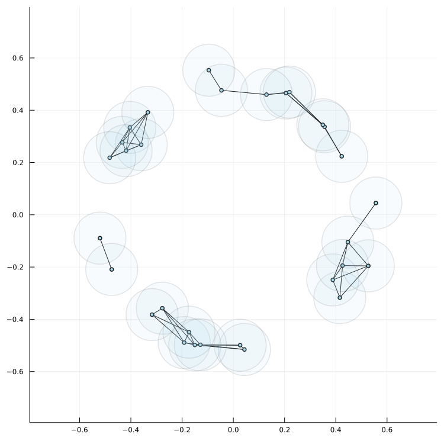

## Prelude

Firstly I will introduce a few mathematical terms.

Most generally, a _Topology_ is a set of subsets on a collection of points. Often we describe a _Metric Space_ as a collection points, endowed with a distance function between points, which can induce a topology on the collection of points.

_Homology_ is a mathematical tool that we use to analyze the shape of a space. More specifically, we use Homology to understand the placement of holes and gaps within a defined Topology.


## Homology

Let us first consider an example where we sample 30 points from a circle.
We will call this our data.


Our goal here is to perform an analysis that will alert us to the fact that our points were sampled from this circle.

Similar to the idea of a metric space, we want to then add structure to our data using distance. In this case we will use standard Euclidean distance, but we could use any distance metric, depending on our problem.

For showcasing purposes, we will choose a distance value, and connect every point that are at least that close.


Here we chose a value of 0.2

We can visualize this by drawing circles around each point of radius 0.1 (half the distance value), in which case any points whose circles intersect are connected.



Here we will introduce a new term.

A _Simplex_ is the abstraction of a triangle in a geometric sense.
 - A 0-simplex is a single point
 - A 1-simplex is two connected points (a line)
 - A 2-simplex is the classic notion of a triangle, 3 connected points

Note that higher dimensional simplices

We can notice in the above graphs that a number of simplices are formed from the connected points.

We call a _Simplicial Complex_ a structure of connected simplices (i.e. the intersection of any two simplices in an simplicial complex is always another simplex)

We can also see that we have a multitude of such formations in our graph above. In fact, creating such graphs could be described as inducing a simplicial complex on our data using a distance parameter.


Finally, when a simplicial complex has a loop with only lower dimensional simplices, we call that a hole.

As an example, if we increase the distance parameter to 0.5, we can see a large hole forming in the center.


The importance of inducing a simplicial complex on our data is very straightforward: it allows us to perform homology on our data, which will compute for us the presence of holes and simplices.

Note that the computation of homology is through application of linear algebra, so we need not worry about the details of such operations right now.

If homology is able to alert us to the presence of a hole in our data, based on a simplicial complex, then the next question which should naturally follow, is how do we choose a distance parameter so we can always find prominent holes and structures in our data?

The primary way to do this is to start with a distance parameter which is very small, and increment it until every data point is connected to every other data point. Using this methodology, we obtain very important information.

Firstly, we can compute at what distance a hole appears and disappears. This allows us to understand the "persistence" of artifacts from our data, which in turn should inform us of whether these artifacts are simply noise, or structural aspects of our data.

For example, we can see that the larger central hole forms at a distance parameter of 0.5 (although it probably forms much earlier). If we increase the distance parameter to 1.2, we lose the central hole.


For smaller holes we would also be able to compute persistence. Generally, when we see holes that appear and disappear over a small increment of our distance parameter, we discard these as noise. When we see more persistent holes, we count these as structures in our data.

Commonly, we call (a,b), the interval of persistent of a hole, as it's _Barcode_. Note that a and b are distance parameter values.

The greater the interval of existence, the more important a hole is generally.

## Persistent Homology and Monte Carlo Methods

While we have discussed the primary usage of homology to a set of data, it still has an important property worth noting.

Intervals of existence are generally stable over noise in the data. This is a very important property, as this tells us that the information we get out of our data should be consistent across different samples.

Relating to this idea of stability, MCMC can be applied to the persistence graphs produced from homology. [In this paper](https://arxiv.org/abs/1711.01570) the authors attempt to create simulated replications of persistence diagrams using the standard Metropolis-Hastings algorithm.

[In another paper](https://arxiv.org/abs/2104.07737) the authors propose "random persistence diagram generation" whose purpose is to make the creation of persistence diagrams more tractable for large datasets.

Persistent homology can be a very useful tool for analyzing structures in data that could be otherwise very hard to find. Persistent homology reaches into many aspects of machine learning, of which Monte Carlo methods are one.


MCMC for persistent homology paper: [https://arxiv.org/abs/1711.01570](https://arxiv.org/abs/1711.01570)

Random persistence diagram paper : [https://arxiv.org/abs/2104.07737](https://arxiv.org/abs/2104.07737)

Code used for graphs (julia):

```julia
using Plots
using Random
amnt = 30
radii = 0.5
data = rand(amnt)*2*π

datax = (cos.(data)+randn(amnt)*1/16)*radii
datay = (sin.(data)+randn(amnt)*1/16)*radii


plot(xlims = [-1,1]*0.75, ylims = [-1,1]*0.75 ,
        size = (750,750) )


rad = 0.6
lines = []
for i in 1:length(data)
    for j in (i+1):length(data)
        if (sqrt((datax[i]-datax[j])^2 + (datay[i]-datay[j])^2)/2)<rad
            plot!([datax[i],datax[j]],[datay[i],datay[j]],
            linecolor = :black,legend=false)
        end
    end
end

scatter!(datax,datay,color = :blues,
        label = "points")
scatter!(datax,datay,color= :blues,markersize =  2*rad*99/0.4,
        markeralpha = 0.1,legend=false)
savefig("stuff5.png")
```
